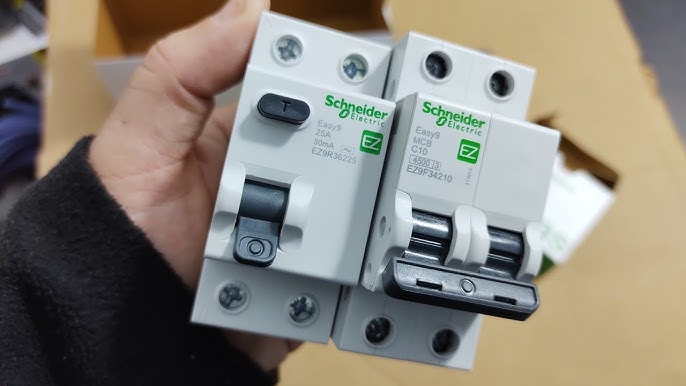

Es la pregunta más común que recibo en mis visitas técnicas en **Arequipa**: *"Juan, ¿por qué tengo tantas palancas en el tablero y para qué sirven?"*.

Muchos hogares antiguos en Perú solo tienen una "llave de cuchilla" o una térmica simple. **Esto es un error mortal.** Para tener una instalación eléctrica segura y cumplir con el **Código Nacional de Electricidad**, necesitas entender la diferencia entre los dos guardianes de tu hogar: la **Llave Termomagnética** y el **Interruptor Diferencial**.

## 1. La Llave Termomagnética (El Guardián de los Cables)

Conocida popularmente como "La Térmica" o "Flipón". Su misión principal es proteger la **instalación eléctrica** (tus cables y equipos), no a las personas.

### ¿Cómo funciona?
Es como un policía de tránsito. Si detecta que están pasando "demasiados autos" (corriente) por un cable delgado, corta el paso para evitar que la carretera (el cable) se queme.

### ¿Por qué salta o se baja la palanca?
Tiene dos enemigos principales:
1.  **Sobrecarga:** Pasa cuando conectas la ducha eléctrica, el microondas y la plancha al mismo tiempo. El cable se calienta y la llave salta antes de que se derrita el aislante.
2.  **Cortocircuito:** Es violento. Ocurre cuando la Fase y el Neutro se tocan directamente (por un cable pelado o un aparato malogrado).

> **Ojo:** Si tocas un cable pelado y solo tienes llave térmica, **te vas a electrocutar** y la llave NO saltará hasta que sea demasiado tarde.

---

## 2. El Interruptor Diferencial (El Salvavidas)

Este es el dispositivo más importante para la seguridad de tu familia. Es obligatorio en todos los tableros modernos.

### ¿Cómo funciona?
Es una balanza ultra sensible. Mide la corriente que entra y la que sale. Si nota que falta aunque sea un poquito de corriente (porque se está desviando a través de tu cuerpo hacia tierra), corta la luz en **milisegundos**.

### ¿Por qué salta el Diferencial?
1.  **Fuga de Corriente:** Un cable está tocando la carcasa de tu lavadora, refri o computadora.
2.  **Descarga Humana:** Alguien metió el dedo al enchufe o tocó un cable pelado.
3.  **Humedad:** Muy común en Arequipa en época de lluvias. Si entra agua a una caja de paso en el techo, el diferencial saltará.

---

## Tabla Comparativa: Térmica vs Diferencial

| Característica | Llave Termomagnética 🌡️ | Interruptor Diferencial 🛡️ |
| :--- | :--- | :--- |
| **¿Qué protege?** | Protege los cables y equipos. | **Protege a las PERSONAS.** |
| **¿Detecta fugas?** | NO. | SÍ (Fugas a tierra). |
| **¿Evita incendios?** | SÍ (Por cable quemado). | NO directamente. |
| **¿Cómo lo reconozco?** | Es simple, solo tiene la palanca. | Tiene un **botón "T" (Test)** pequeño. |
| **Costo promedio** | Más económico (S/ 20 - S/ 60). | Más costoso (S/ 80 - S/ 150). |

---

## ¿Qué hago si "se baja" la palanca?

Si se va la luz en tu casa, fíjate cuál de las dos saltó:

* **Si saltó la Térmica:** Desenchufa los aparatos que consumen mucho (estufas, duchas) e intenta subirla. Si vuelve a saltar, tienes un cortocircuito franco.
* **Si saltó el Diferencial:** ¡Cuidado! Hay una fuga. Puede ser un electrodoméstico fallando o humedad en las paredes. **No lo fuerces** o podrías recibir una descarga al intentar subirlo.

## Recomendación del Experto

Nunca puentees (elimines) una llave porque "salta mucho". Si salta, es porque te está avisando de un peligro.

Si tu tablero no tiene **Interruptor Diferencial**, estás viviendo en riesgo. En **Quilla Electric** podemos actualizar tu tablero en un par de horas, instalando marcas certificadas como **Schneider, BTicino o Siemens**.

[**👉 ¡Quiero actualizar mi tablero y proteger a mi familia!**](/contacto)