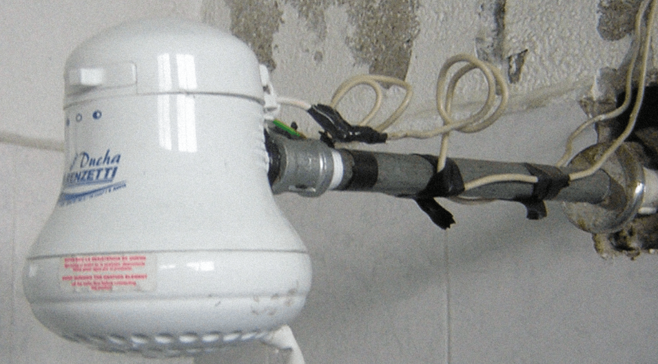

En Arequipa, una ducha caliente no es un lujo, es una necesidad. Vas a la ferretería, compras tu ducha **Lorenzetti** o **Rapiducha**, llamas al "maestro" del barrio y listo.

Pero a la semana siguiente: **olor a plástico quemado**, la llave salta a mitad del baño o, peor aún, sientes "cosquilleos" al tocar la perilla.

Instalar una ducha eléctrica parece fácil, pero es uno de los aparatos que **más energía consume** en toda la casa (más que 50 focos juntos). Aquí te cuento los 3 errores mortales que veo a diario.

## Error 1: Usar los cables que ya estaban ahí
El error clásico: conectar la ducha a los cables de la luz del techo (iluminación).
* **El Problema:** Los cables de luz son delgados (calibre 14). La ducha necesita un cable grueso (calibre 10 o 12) para soportar la potencia.
* **El Resultado:** El cable delgado se calienta como una resistencia, derrite el aislamiento y provoca un cortocircuito dentro del techo.

## Error 2: El "Empalme" con Cinta Aislante
Nunca, jamás, se debe usar cinta aislante simple dentro de la ducha.
* **El Problema:** El vapor del agua despega la cinta. Los cables quedan expuestos y con el óxido hacen falso contacto.
* **La Solución:** Se deben usar **conectores de porcelana** o **cintillos de seguridad**. O mejor aún, hacer un empalme profesional soldado y vulcanizado si es posible.

## Error 3: No ponerle su propia Llave Térmica
Muchos conectan la ducha directo a los enchufes de la casa.
* **El Problema:** Cuando te bañas, le robas energía a toda la casa. Si alguien prende el microondas, ¡PUM! Se va la luz.
* **La Solución:** La ducha debe tener su **propio circuito independiente** desde el tablero general, con su propia llave térmica de 25A o 30A.

---

## ¿Y la conexión a Tierra? (Cable Verde/Amarillo)
Si tu ducha tiene un cablecito verde colgando y el instalador te dijo *"eso no sirve, córtalo"*, **te puso en peligro de muerte**.
Ese cable debe ir conectado al sistema de puesta a tierra de la casa. Si hay una falla interna en la ducha, la corriente se irá por ese cable y no a través de tu cuerpo (agua).

## Recomendación Profesional

No juegues con agua y electricidad. Una ducha mal instalada es una bomba de tiempo.

En **Quilla Electric** realizamos la instalación certificada:
1.  Cableado independiente desde el tablero.
2.  Llave térmica exclusiva.
3.  Conectores adecuados (sin cinta).

[**👉 ¡Quiero instalar mi ducha de forma segura!**](/contacto)