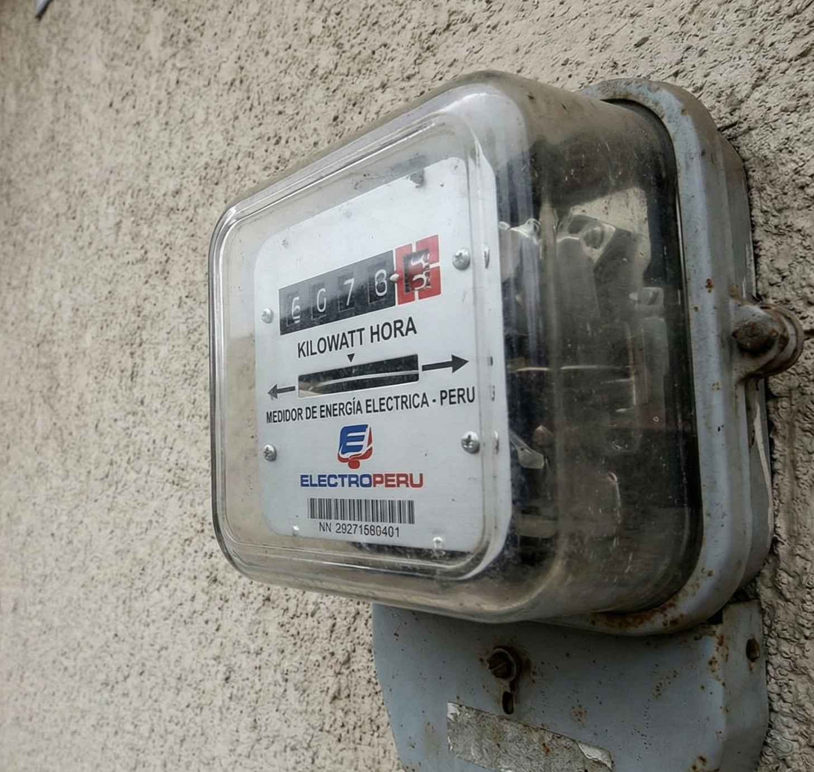

¿Este mes tu recibo de **SEAL** o **Enel** llegó por las nubes y no sabes por qué? Es la queja #1 que atiendo en Arequipa.

Muchos clientes piensan que "el medidor está mal" o que la empresa de luz les roba. Pero en el 90% de los casos, el enemigo está dentro de casa. Se llama **Fuga de Corriente a Tierra**.

## ¿Qué es una "Fuga de Luz"?
Imagina una tubería de agua con un agujero pequeño. El agua se escapa las 24 horas, aunque tengas los caños cerrados. En electricidad pasa lo mismo: un cable pelado toca la pared o un fierro, y la energía se escapa a tierra. **Tu medidor cuenta esa energía perdida y tú la pagas.**

## Las 5 Causas Principales de un Recibo Alto

1.  **Cables Antiguos (Más de 20 años):** El aislamiento de tela o goma se reseca y agrieta, dejando escapar la corriente.
2.  **Empalmes con Cinta Mala:** Si usaron cinta aislante barata en las uniones dentro de los tubos, con la humedad se despega y genera fugas.
3.  **Electrodomésticos "Vampiro":**
    * Una refrigeradora con el jebe de la puerta gastado (el motor nunca para).
    * Una bomba de agua que se traba.
    * Termas eléctricas con la resistencia sarrosa.
4.  **Humedad en Paredes:** El agua es conductora. Si tienes una pared con salitre por donde pasan cables, es muy probable que haya fuga.
5.  **Robo de Energía:** Tristemente común. A veces un cable "vecino" está conectado a tu línea.

---

## La Prueba Maestra: ¿Cómo saber si tengo fuga?

Haz este diagnóstico rápido en casa antes de llamarnos:

1.  **Desenchufa TODO:** Desconecta refrigeradora, TV, modem, microondas. Apaga todas las luces.
2.  **Mira el Medidor:**
    * Si es digital: ¿La luz roja sigue parpadeando?
    * Si es de disco: ¿El disco sigue girando?
3.  **El Veredicto:** Si con todo desconectado el medidor sigue avanzando, **TIENES UNA FUGA FIJA**.

### ¿Qué hago ahora?
No intentes adivinar. En **Quilla Electric** usamos instrumentos de precisión (**Pinza de Fugas y Megómetro**) para rastrear el punto exacto de la falla sin romper todas tus paredes.

> **Dato:** Reparar una fuga se paga solo con lo que ahorras en el primer o segundo recibo de luz.

[**👉 ¡Solicitar revisión de Fuga de Corriente!**](/contacto)